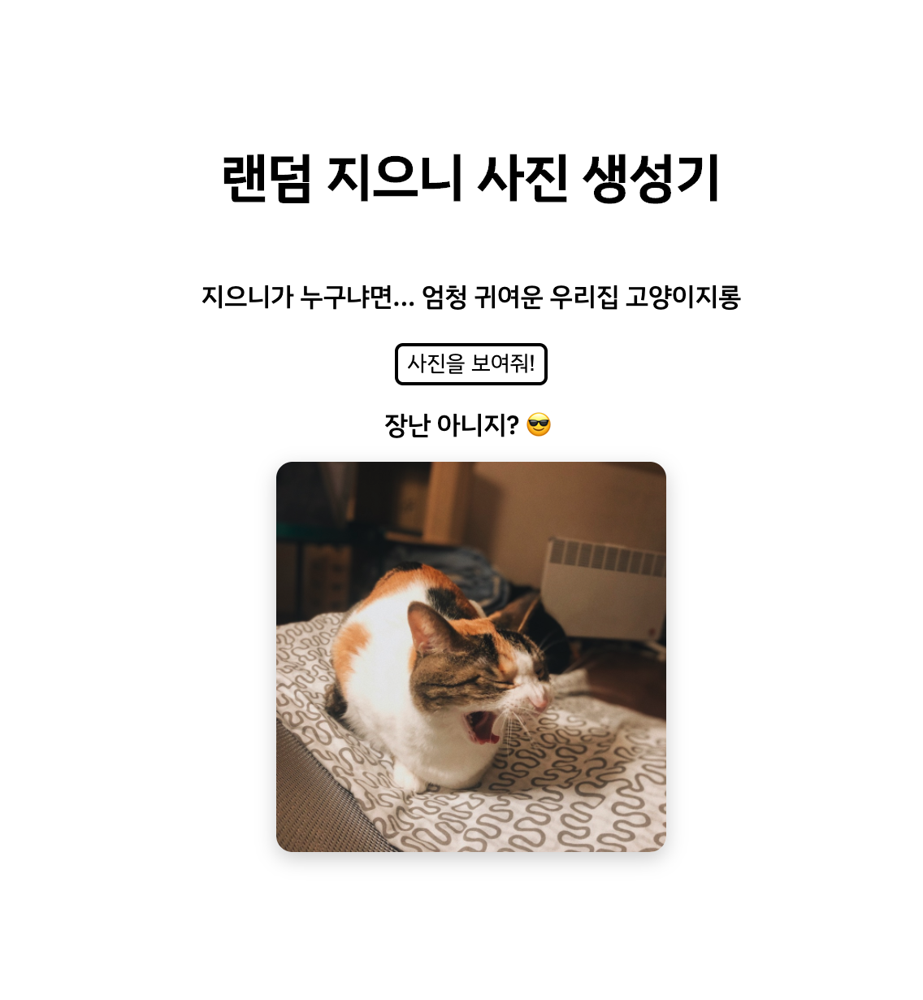

# 랜덤 지으니 사진 생성기

* `사진을 보여줘!` 버튼을 클릭하면 서버에서 귀여운 지은이(본명)의 사진을 랜덤하게 가져옵니다.
* 50%의 확률로 약 3초의 딜레이가 있습니다. 응답을 대기하는 중에 `사진을 보여줘!` 버튼을 클릭하면 기존 요청을 취소하고 다른 사진을 가져옵니다.
* `사진을 보여줘!` 버튼에는 디바운싱이 적용되어 있습니다. 500ms 보다 작은 간격으로 버튼을 여러번 클릭할 경우에는 마지막으로 눌린 시점에 핸들러를 한번만 실행합니다.
* 클라이언트는 바닐라 자바스크립트로, 서버는 Koa.js로 구현했습니다.